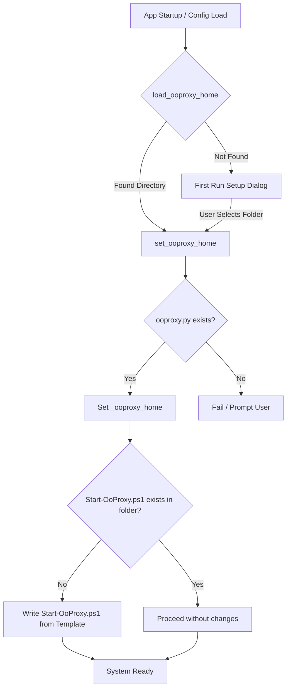

# Auto-Generation of Start-OoProxy.ps1

This document outlines the design, implementation, and verification details of the feature that automatically generates the `Start-OoProxy.ps1` script inside the active `ooproxy` directory (whether it is the bundled git submodule or a user-selected custom folder).

---

## 1. Overview & Goal

The `ooUI` application relies on a PowerShell script (`Start-OoProxy.ps1`) to manage the lifecycle of the Windows Scheduled Task for starting the proxy minimized in the system tray at user logon. 

To prevent errors when this script is missing (e.g., if the user hasn't initialized git submodules properly, or if the file was deleted), we introduced robust self-healing logic. When `ooUI` starts or when the user configures a custom `ooproxy` home directory, the application automatically verifies whether the script is present in the target directory and recreates it using a standard template if it is missing.

---

## 2. Technical Architecture & Flow

The resource configuration and path discovery are centralized in [gui/resources.py](file:///c:/Users/mrdra/OneDrive/Documentos/GitHub/ooUI/gui/resources.py).

Whenever the `ooproxy_home` directory is resolved or updated, the system triggers the automatic generation check:



---

## 3. Implementation Details

### Changes to `gui/resources.py`

1. **PowerShell Script Template (`START_OOPROXY_TEMPLATE`)**:
   We added a raw triple-quoted Python string `START_OOPROXY_TEMPLATE` containing the exact standard contents of the `Start-OoProxy.ps1` PowerShell script. Using a raw string avoids backslash escaping issues.

2. **Auto-Write on Path Resolution**:
   We modified the `set_ooproxy_home(path: str | Path)` helper function to verify the presence of `Start-OoProxy.ps1`:

   ```python
   def set_ooproxy_home(path: str | Path) -> None:
       """Update the in-process ooProxy root. Called after config save or first-run."""
       global _ooproxy_home
       p = Path(path)
       if (p / "ooproxy.py").exists():
           _ooproxy_home = p
           # Automatically generate Start-OoProxy.ps1 if missing in the selected directory
           try:
               ps_script = p / "Start-OoProxy.ps1"
               if not ps_script.exists():
                   ps_script.write_text(START_OOPROXY_TEMPLATE, encoding="utf-8")
           except Exception:
               pass
   ```

   Wrapping the write operation in a `try-except` block ensures that if the target directory is read-only or has permission restrictions, it won't crash the application launch sequence.

---

## 4. Testing & Verification

### Unit Tests
We introduced a dedicated test suite in [tests/test_resources.py](file:///c:/Users/mrdra/OneDrive/Documentos/GitHub/ooUI/tests/test_resources.py) to cover the new logic:

- `test_set_ooproxy_home_generates_ps1_if_missing`:
  Ensures that when `set_ooproxy_home` is called with a directory containing `ooproxy.py` but missing `Start-OoProxy.ps1`, the script is generated automatically with identical content to the template.

- `test_set_ooproxy_home_does_not_overwrite_existing_ps1`:
  Ensures that if the script already exists (e.g. customized or modified by the user), it is left completely untouched.

### Execution Results
The test suite was verified successfully using `pytest`:

```powershell
============================= test session starts =============================
platform win32 -- Python 3.14.3, pytest-9.0.3, pluggy-1.6.0
collected 80 items

test_local_proxy.py .                                                    [  1%]
tests\test_health_checker.py ....                                        [  6%]
tests\test_proxy_controller.py ...........                               [ 20%]
tests\test_resources.py ..                                               [ 22%]
tests\test_security.py ..............................................    [ 80%]
tests\test_settings_controller.py .........                              [ 91%]
tests\test_tools_controller.py .......                                   [100%]

======================== 80 passed, 1 warning in 5.87s ========================
```
